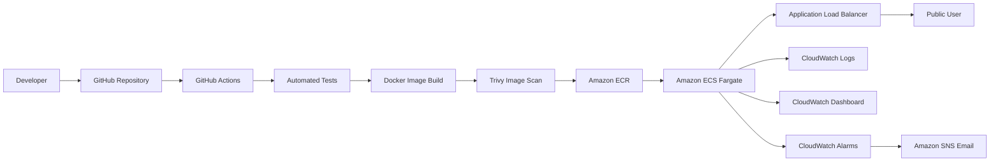
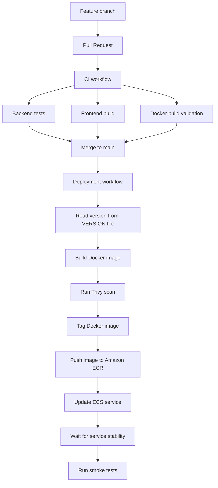
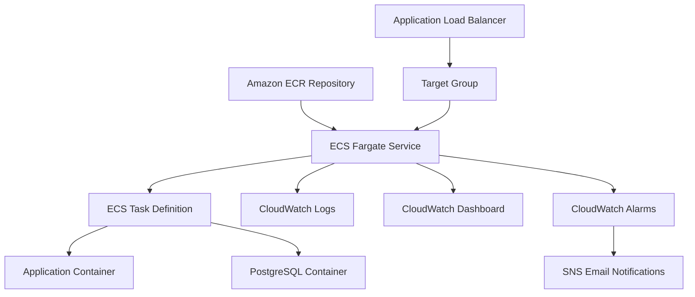
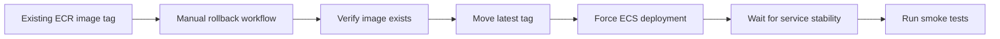

# Betcloud Training Hub

**Training Hub** is a containerized web application prepared for a DevOps project.
The application represents a simple training management platform for **Betcloud**.

The main purpose of this repository is to demonstrate a complete DevOps delivery process: application build, automated tests, Docker image creation, image publishing, infrastructure provisioning and deployment to AWS.

## Project information

| Field | Value |
|---|---|
| Application | Training Hub |
| Company | Betcloud |
| Author | Jarosław Bętkowski |
| Runtime platform | Amazon ECS Fargate |
| Container registry | Amazon ECR |
| Infrastructure as Code | Terraform |
| CI/CD | GitHub Actions |
| Observability | Amazon CloudWatch |

## Overview

Training Hub contains a frontend application, backend API and PostgreSQL database.
The application exposes health, version and business endpoints required for deployment verification and CI/CD smoke tests.

The project includes:

- application source code,
- Dockerfile and Docker Compose configuration,
- automated backend tests,
- GitHub Actions CI/CD workflows,
- Docker image publishing to Amazon ECR,
- deployment to Amazon ECS Fargate,
- AWS infrastructure defined in Terraform,
- CloudWatch logs, dashboard and alarms,
- SNS email notifications,
- ECR lifecycle policy,
- Trivy image security scan,
- manual rollback workflow.

## Technology stack

| Area | Technology |
|---|---|
| Frontend | React, Vite |
| Backend | FastAPI |
| Database | PostgreSQL |
| Migrations | Alembic |
| Containerization | Docker, Docker Compose |
| CI/CD | GitHub Actions |
| Infrastructure | Terraform |
| Registry | Amazon ECR |
| Deployment | Amazon ECS Fargate |
| Public access | Application Load Balancer |
| Logs and monitoring | Amazon CloudWatch |
| Notifications | Amazon SNS |
| Image scanning | Trivy |

## Architecture



Deployment flow:

```text
GitHub → GitHub Actions → Amazon ECR → Amazon ECS Fargate → Application Load Balancer → Public URL
```

## CI/CD process

The CI/CD process is split into separate workflows for validation, deployment and rollback.



The deployment workflow performs the following actions automatically:

1. Runs backend tests.
2. Builds the frontend.
3. Builds the Docker image.
4. Scans the Docker image with Trivy.
5. Tags the image as `latest` and with the version from the `VERSION` file.
6. Pushes both tags to Amazon ECR.
7. Forces a new deployment of the ECS service.
8. Waits until the ECS service is stable.
9. Runs smoke tests against the public URL.

## Application endpoints

Required endpoints:

```text
GET /health
GET /version
GET /training-process
```

Additional API endpoints:

```text
GET /api/health
GET /api/version
GET /api/training-process
GET /api/docs
```

| Endpoint | Description |
|---|---|
| `/health` | Health check endpoint used by AWS load balancer and smoke tests |
| `/version` | Returns the currently deployed application version |
| `/training-process` | Business endpoint for the Training Hub domain |
| `/api/docs` | FastAPI OpenAPI documentation |

## Public URL

```text
http://training-hub-alb-1068184646.eu-central-1.elb.amazonaws.com
```

Production endpoint checks:

```bash
curl http://training-hub-alb-1068184646.eu-central-1.elb.amazonaws.com/health
curl http://training-hub-alb-1068184646.eu-central-1.elb.amazonaws.com/version
curl http://training-hub-alb-1068184646.eu-central-1.elb.amazonaws.com/training-process
```

The same URL is available as Terraform output:

```bash
cd infra
terraform output application_url
```

## Demo account

A demo account is created during application startup.

```text
login: demo
password: demo
```

Alternative login:

```text
demo@example.com
```

The deployment contains demo data only.

## Local Docker run

Start the application locally:

```bash
docker compose up --build
```

Open the application:

```text
http://localhost:8000
```

Check local endpoints:

```bash
curl http://localhost:8000/health
curl http://localhost:8000/version
curl http://localhost:8000/training-process
```

Stop containers:

```bash
docker compose down
```

Stop containers and remove local volumes:

```bash
docker compose down -v
```

## Local development

Start PostgreSQL for local development:

```bash
docker compose -f docker-compose.dev.yml up -d
```

Start backend:

```bash
cd backend
cp ../.env.example .env
alembic upgrade head
python seed.py
python seed_demo.py
uvicorn app.main:app --reload
```

Start frontend:

```bash
cd frontend
npm ci
npm run dev
```

## Tests

Run backend tests:

```bash
cd backend
python -m venv .venv
source .venv/bin/activate
pip install -r requirements.txt -r requirements-dev.txt
pytest
```

## Docker image

The application image is built from the root `Dockerfile`.

The image contains:

- built frontend assets,
- FastAPI backend,
- application version from the `VERSION` file.

The container exposes port `8000`.

## Infrastructure as Code

Terraform configuration is stored in the `infra/` directory.

The infrastructure includes:

- Amazon ECR repository,
- Amazon ECS Fargate cluster,
- ECS task definition,
- ECS service,
- Application Load Balancer,
- target group with `/health` health check,
- security group for the load balancer,
- security group for ECS tasks,
- IAM role for ECS task execution,
- CloudWatch Log Group,
- CloudWatch Dashboard,
- CloudWatch Alarms,
- SNS topic for alarm notifications,
- ECR lifecycle policy.

Terraform commands:

```bash
cd infra
terraform init
terraform validate
terraform plan
terraform apply
```

Destroy infrastructure:

```bash
terraform destroy
```

Terraform state files and local variable files are excluded from the repository.

## AWS resources



Main AWS resources:

| Resource | Name |
|---|---|
| ECR repository | `training-hub` |
| ECS cluster | `training-hub-cluster` |
| ECS service | `training-hub-service` |
| ECS task family | `training-hub-task` |
| ALB | `training-hub-alb` |
| Target group | `training-hub-tg` |
| CloudWatch Log Group | `/ecs/training-hub` |
| CloudWatch Dashboard | `training-hub-dashboard` |
| SNS topic | `training-hub-alarms` |

## Observability

The application is monitored using AWS-native services.

Implemented observability elements:

- `/health` endpoint,
- ALB target group health checks,
- CloudWatch Logs,
- CloudWatch Dashboard,
- CloudWatch Alarms,
- SNS email notifications.

Configured alarms:

| Alarm | Description |
|---|---|
| `training-hub-ecs-high-cpu` | ECS service CPU utilization alarm |
| `training-hub-alb-target-5xx` | Target group HTTP 5XX response alarm |
| `training-hub-alb-unhealthy-targets` | Unhealthy target count alarm |

The alarm notification email is provided through a local Terraform variable and is not stored in the repository.

## Security and maintenance

The deployment pipeline includes a Docker image scan using Trivy.

The scan checks:

- operating system packages,
- application dependencies,
- HIGH and CRITICAL vulnerabilities.

The scan is informational and visible in GitHub Actions logs.

Amazon ECR lifecycle policy is managed by Terraform.

Image cleanup rules:

- keep the last 10 tagged images,
- remove untagged images older than 7 days.

Secrets used by CI/CD are stored in GitHub Actions secrets and are not committed to the repository.

## Manual rollback

The repository includes a manual rollback workflow:

```text
.github/workflows/rollback.yml
```

Rollback process:



The workflow accepts an existing ECR image tag, moves the `latest` tag to that image, forces a new ECS deployment and verifies the deployment with smoke tests.

Example image tag:

```text
0.9.5-docker-demo
```

## GitHub Actions

Workflows:

| Workflow | Purpose |
|---|---|
| `ci.yml` | Runs tests, builds frontend and validates Docker image build |
| `deploy.yml` | Builds, scans, publishes and deploys the application |
| `rollback.yml` | Performs manual rollback to an existing ECR image tag |

## GitHub Actions configuration

Required repository secrets:

```text
AWS_ACCESS_KEY_ID
AWS_SECRET_ACCESS_KEY
AWS_REGION
AWS_ACCOUNT_ID
ECR_REPOSITORY
ECS_CLUSTER
ECS_SERVICE
```

Required environment variable in the `production` GitHub Environment:

```text
APP_PUBLIC_URL
```

Secret values are stored in GitHub Actions configuration, not in the repository.

## Environment files

The repository contains example environment files:

```text
.env.example
frontend/.env.example
```

Real local environment files are ignored by Git:

```text
.env
backend/.env
frontend/.env
frontend/.env.local
```

## Versioned deployment

Application version is stored in the `VERSION` file.

A typical version change is done on a feature branch:

```bash
git checkout main
git pull
git checkout -b feature/version-bump-demo

printf "0.9.6-docker-demo\n" > VERSION

git add VERSION
git commit -m "Bump application version to 0.9.6"
git push -u origin feature/version-bump-demo
```

After the Pull Request is merged into `main`, the deployment workflow publishes a new Docker image and deploys it to ECS.

Version check:

```bash
curl http://training-hub-alb-1068184646.eu-central-1.elb.amazonaws.com/version
```

## Repository structure

```text
.
├── backend/
├── frontend/
├── infra/
├── docs/
│   └── screenshots/
├── .github/
│   └── workflows/
├── Dockerfile
├── docker-compose.yml
├── docker-compose.dev.yml
├── README.md
└── VERSION
```

## Database note

For this project, PostgreSQL runs as a sidecar container in the ECS task.
This keeps the deployment compact and cost-effective while still allowing the application to run with a real database engine.

The application and database containers are deployed together as one ECS task.
